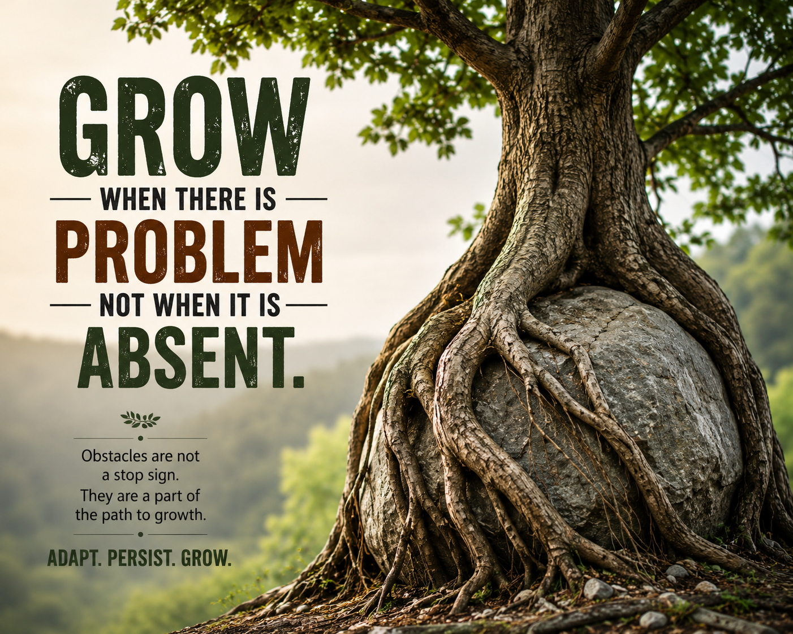

# Today Is Mine

## Step 1: Focus on Today

## Daily Affirmation

* ✅ I get one shot today.
* ✅ Yesterday was data.
* ✅ Tomorrow is possibility.
* ✅ Today is execution.

## What I Control

* ✅ My effort
* ✅ My attitude
* ✅ My decisions

## What I Release

* ✅ Outcomes
* ✅ Other people’s opinions
* ✅ Perfectionism

## What I Accept

* ✅ Everything else is noise until it arrives.
* ✅ Challenges will come. Good.
* ✅ Pressure is not a signal to stop. It is a signal that growth is happening.

## What I Am Building

* ✅ A stronger career
* ✅ Deeper expertise
* ✅ Better opportunities
* ✅ A secure future for my family

## The Bridge to My Future

* ✅ The bridge between my future vision and my present reality is built with today’s focus.
* ✅ Great things are not achieved in one giant leap.
* ✅ They are built through consistent action.

## Daily Focus

* ✅ I do not need perfect conditions.
* ✅ I do not need certainty.
* ✅ I do not need motivation.
* ✅ I need movement.
* ✅ One task executed.
* ✅ One concept learned.
* ✅ One conversation navigated well.
* ✅ One step closer.

## End-of-Day Check

At the end of today, I will be able to say:

* ✅ I showed up.
* ✅ I did the work.
* ✅ I moved forward.

## Reflection

* ✅ Progress compounds.
* ✅ Small wins repeated daily become extraordinary results.
* ✅ If I lose focus, I will course-correct immediately.
* ✅ I will not wait for tomorrow to reset.
* ✅ Focus on the next right action. Not the entire journey.

## Today’s Primary Target

* ✅ **TODAY IS MINE.**
* ✅ **LET'S BEGIN.**

---

## Step 2: Focus on the Next Right Action

## The Next Right Action

### Daily Reminder

I do not need to solve my entire life today.

I need to:

* ✅ Do the next important thing.
* ✅ Finish what I start.
* ✅ Learn something useful.
* ✅ Treat people well.
* ✅ Leave today better than I found it.

Progress compounds.

The future is built by ordinary days repeated consistently.

## Execution > Emotion

Some days I will feel motivated.

Some days I won't.

Both days count.

My success will be determined by what I do, not by how I feel.

Focus on the next right action.

## Current Reality

* ✅ This situation is temporary.
* ✅ I am transitioning.
* ✅ I will stay calm, professional, and not react emotionally.
* ✅ My focus now is study, exams, and building expertise.
* ✅ My next phase will come at the right time.

I DO NOT NEED TO MOVE FAST.

I NEED TO KEEP MOVING.

**ONE FOCUSED DAY.**

**THEN ANOTHER.**

**THEN ANOTHER.**

**THAT IS ENOUGH.**

---

## Step 3: Grow When There Are Problems

**GROW WHEN THERE ARE PROBLEMS, NOT WHEN THEY ARE ABSENT.**

Obstacles are not a stop sign.

They are part of the path to growth.

The tree did not wait for the rock to move.

It adapted.

It persisted.

It grew around the obstacle.

**ADAPT. PERSIST. GROW.**

---

## Step 4: Practice Strategic Discretion

### Protect These Areas of Your Life

* ✅ My next move — Build first. Announce later.
* ✅ My unfinished plans and early-stage ideas — Protect the blueprint until it is ready.
* ✅ My financials — Wealth is built, not broadcast.
* ✅ My digital identity — Protect my information as carefully as my reputation.
* ✅ My biggest dreams and long-term goals — Share only with people who can genuinely help.
* ✅ My daily routine and discipline — Let consistency become visible through results.
* ✅ My family matters — Guard the privacy and peace of those I love.
* ✅ My struggles, fears, and weaknesses — Share only with trusted mentors, confidants, or professionals.
* ✅ My mistakes and failures — Share when accountability is required or when the lesson can help others.
* ✅ My personal growth — Progress does not require an audience.

## My Operating Principle

Silence is not secrecy.

Privacy is not isolation.

Discretion is knowing what to share, when to share it, and with whom.

Wisdom is knowing what to say, what to keep private, and when to do both.

Not everyone needs access to my journey.

Trust is earned over time through integrity, consistency, and sound judgment.

## Reflection

* ✅ Privacy preserves focus.
* ✅ Silence protects momentum.
* ✅ Consistency beats publicity.
* ✅ Trust is earned, not assumed.
* ✅ Results create credibility.

## Final Reminder

**BUILD IN SILENCE.**

**SHARE WITH WISDOM.**

**LET RESULTS MAKE THE NOISE.**

---

## Step 5: Character Before Outcome

### Daily Standard

* ✅ Be honest.
* ✅ Be professional.
* ✅ Keep commitments.
* ✅ Take responsibility.
* ✅ Treat people with respect.
* ✅ Do the right thing even when nobody is watching.

### Reminder

My reputation is built one interaction at a time.

Skills open doors.

Character determines what I do after I walk through them.

### Reflection

* ✅ Integrity compounds.
* ✅ Trust compounds.
* ✅ Consistency compounds.
* ✅ Character outlasts success.

## Final Principle

Results measure what I achieve.

Character defines who I become.

The goal is not simply to achieve success.

The goal is to become the kind of person who can sustain it.

**CHARACTER IS DESTINY.**

---

## Daily Operating System

When uncertain:

Focus on today.
Take the next right action.
Grow through obstacles.
Practice strategic discretion.
Choose character over convenience.

Then begin again tomorrow.

That is enough.

That is how an extraordinary life is built.

**TODAY IS MINE. LET'S BEGIN.**
